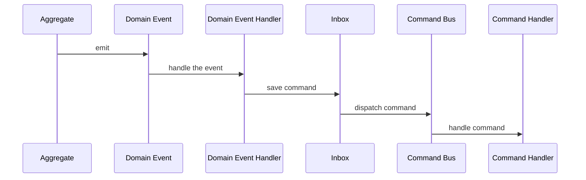

# Inter-modules communication

Modules should be highly decoupled from each other but there should also be a way to communicate between them. This is
 achieved by using domain events and derivatives of those and queries.

## Events

Events enable processing commands that span over multiple modules 

### Types

The table summarizes events and the context under which they should be used.

|     Event type    |                                                                            Emitter/Handler transaction                                                                           | Emitter/Handler Bounded Context |
|:-----------------:|:--------------------------------------------------------------------------------------------------------------------------------------------------------------------------------:|:-------------------------------:|
| Domain Event      | Private: same transaction  Public: 1. `Command` that derives from `Domain Event` saved in `Outbox` in same transaction 2. handler executed in a separate transaction |             Same          |
| Integration Event |                                                                                     Separate                                                                                     |             Separate            |

#### Domain Event

Used mainly to split use case processing that needs to be handled by multiple "DDD modules" or `Aggregates` which are 
part of the same Bounded Context.

##### Controlling module's events API

It may be undesirable to expose given event emitted by a module to other modules when e.g. the event holds sensitive 
data. That's why only `public` events should be exposed to other modules.

##### Transactional boundary

In this project the transactional boundary is defined by `Command` and each module manages its own transaction. That 
poses a problem when a `Domain Event` is emitted by a module and handled by another module. In such situation 
additional mechanism needs to be introduced to assure that the event is handled by the subscriber even when the 
system crashes during handling the event. This is achieved by using `Inbox` pattern.

Inbox pattern (very similar to (Outbox)[https://microservices.io/patterns/data/transactional-outbox.html]) 
guarantees "at leas once delivery". Because of the guarantee it's important for the handlers to process `Domain 
Event` idempotently.

##### Other considerations

Some projects distinguish more explicitly between private and public `Domain Events` - for example by introducing 
`Domain Event Notification` (see (blog post by Kamil Grzybek)[https://www.kamilgrzybek.com/blog/posts/handling-domain-event-missing-part]).
It was decided not to follow such approach because:
1. As was stated before, the transactional boundary is defined by `Command` and involving `Domain Event Notification` 
   breaks this rule.
2. `Domain Event` and `Domain Event Notification` that derives from the `Domain Event` inform about the exactly same 
   fact that happened in the system and the only reason for introducing `Domain Event Notification` is technical 
   which should not be the case for domain code. If `Domain Event Notification` is introduced, there can be a 
   situation when both `Domain Event` and `Domain Event Notification` are subscribed by a module which is 
   confusing.

##### Implementation of Domain Event handling in a separate transaction

As mentioned before, `Inbox` pattern is used to handle `Domain Event` in a separate transaction. There is a 
difference in how most other projects use it for events handling which is the result of the above considerations.

In most projects `Inbox` (or `Outbox`) is used to store `Domain Event` while this project uses it to store `Command` 
that is created with `Domain Event`.

Because `Commands` that are derived from `Domain Event` are stored in an `Inbox` and processed only "eventually" with 
some undetermined time delay, the event's handler might expect different payload. This requires versioning the 
commands.

In the future, this may require differentiating between `Internal Command` that is created with `Domain Event` and 
`Command` that is created by a user or a separate `Bounded Context`.

#### Integration Events

They are very much like `Notification` but processed in a different Bounded Context

## Queries

Queries enable retrieving data from other modules

### Types

|      Query type      | Emitter/Handler Bounded Context |                      Comment                     |
|:--------------------:|:-------------------------------:|:------------------------------------------------:|
| Externally triggered |             Separate            | Triggered by Client or different Bounded Context |
| Internally triggered |               Same              |       Triggered in the same Bounded Context      |

As `Query` is processed immediately in the same process it does not require versioning nor serialization and storing.

## Definitions of events, queries and queries results

Handling module should have the same event/query payload definition as the emitter or a subset of those. This 
doesn't mean that they need to share code as they each party can hold own copy of the payload.

Sharing code is acceptable for `Domain Event` and `Internally Triggered Query` as they are emitted and handled in 
the same Bounded Context. However, they should be accessible by different modules within Bounded Context from a 
single file and tests should ensure that modules do not import any other files.

Sharing code is not acceptable for all other events and queries as they are emitted and handled in different Bounded 
Contexts and importing `python modules` is forbidden between them.

## Events and queries delivery

Modules being decoupled means `python modules` must not be imported from external modules, or importing should be 
restricted to a `python module` which publishes an interface of a module. That makes it impossible to trigger 
external's module command handler (`ExternalModuleCommandHandler().handle(command)`) directly or even by some entry 
point provided by the module (`external_module.handle(command)`).

To deliver events and queries an independent (not belonging to any emitter nor handler) mediator/bus/pud-sub 
solution is required.

As mentioned in [Command and queries ADR](./06-commands-and-queries.md) the decision on using mediator will be made
after some use cases are implemented. However, if there's no need to distinguish between `externally and internally
triggered queries` (discussed in [Queries](#Queries)), the mediator should be used as the queries between modules
must use mediator.

## References
https://buildplease.com/pages/vos-in-events/#:~:text=Events%20are%20immutable.,Objects%2C%20but%20not%20for%20Events
https://www.kamilgrzybek.com/blog/posts/modular-monolith-integration-styles
https://www.kamilgrzybek.com/blog/posts/handling-domain-event-missing-part
https://github.com/kgrzybek/modular-monolith-with-ddd
https://devblogs.microsoft.com/cesardelatorre/domain-events-vs-integration-events-in-domain-driven-design-and-microservices-architectures/
