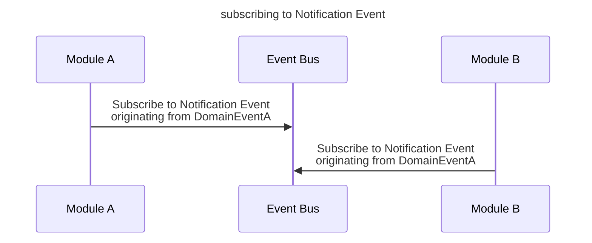
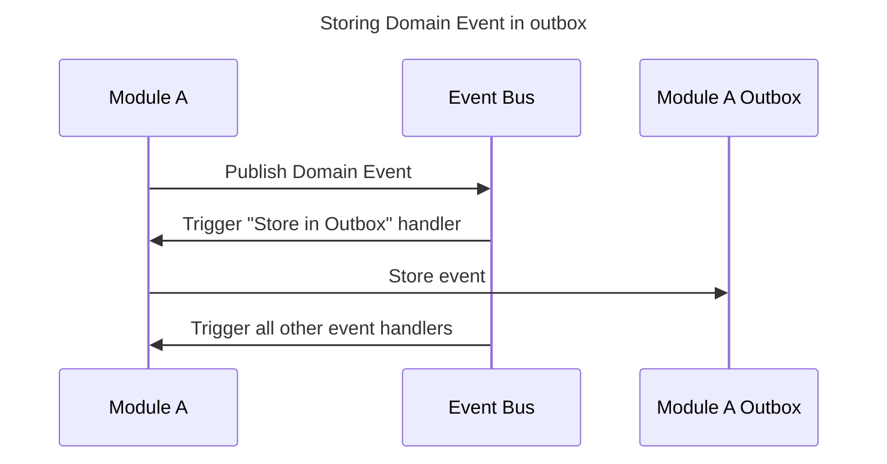
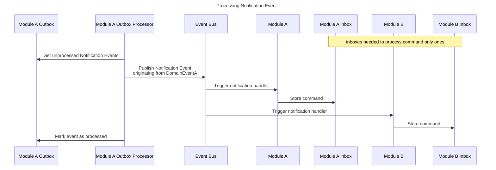
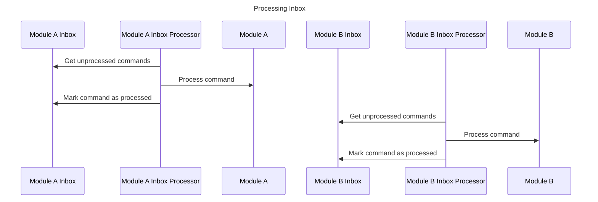

# Introduce Notification Event

In [Inter-module communication ADR](./07-inter-module-communication.md) the concepts of domain and Integration Events 
were introduced. At the moment of writing the mentioned ADR it was believed that those two types of events are
sufficient. During implementation of inter-module communication it turned out that there is a need for a third type.

## Problem

As modules use separate database transactions, the problem of exactly once processing of events needs to be 
addressed. Outbox and Inbox patterns are commonly used to solve this problem and they are used in this project as 
well. However, with the current implementation of inter-module communication, the following scenario is possible:

1. Module A publishes an event
2. The event is stored in Module A's Outbox
3. Module B attempts to store the event in its Inbox but fails

A simple solution in case of such a failure is to retry the operation. However, this is impossible to do as both 
Module A and Module B handlers may subscribe to the same event. Simply re-publishing the event would result in
duplicate processing of the event by Module A.

## Solution

The solution to the problem is to introduce a third type of event - Notification Event. The Notification Event is
kind of a wrapper around the Domain Event. It informs modules that the Domain Event was published and that
they should process it in a separate transaction. It may be used both by the module that publishes the originating 
Domain Event and by others.

### Impact on Integration Events

At the moment of writing this ADR Integration Events are not implemented yet. Their role is to enable communication 
between different bounded contexts, in separate transactions. That makes them very similar to Notification Events. 
When implementing Integration Events, the code created for handling Notification Events should be reused.

### Implementation details

The Notification Event can be implemented as a separate class that literally wraps the Domain Event.

## References
https://www.kamilgrzybek.com/blog/posts/handling-domain-event-missing-part
https://devblogs.microsoft.com/cesardelatorre/domain-events-vs-integration-events-in-domain-driven-design-and-microservices-architectures/
